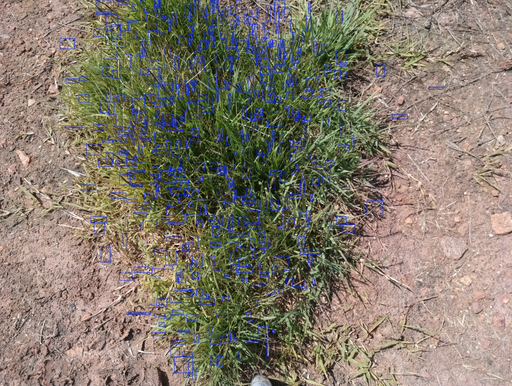

# Zoysia Seed Head Detector

A computer vision model for detecting seed heads in zoysia grass images, developed for image-based phenotyping.


<!-- TODO: rename your example image file before committing — avoid filenames containing emails/usernames -->

## Overview

Manually counting seed heads across large field trials is slow and labor-intensive. This model automates seed head detection from RGB images, supporting high-throughput phenotyping of zoysia cultivars for [TODO: specific trait/breeding goal — e.g., seed head density per plot]. The model is designed to give a reliable estimate of seed head counts per plot or per image.

This repository contains the trained model, inference scripts, and example usage so others can apply it to their own images.

## Model Details

| | |
|---|---|
| **Architecture** | YOLOv8m |
| **Input** | RGB images collected by the monocam (4032x3040) |
| **Output** | Bounding boxes + confidence scores per seed head |
| **Training data** | 310 images comprising a mix of semifield benchbot and real-world plot images, labeled by hand using a student/teacher method |
| **Performance** | mAP@0.5 = 0.61, mAP@0.5:0.95 = 0.40, mAP@0.75 = 0.45, precision = 0.75, recall = 0.43 (held-out test set of 100% real-world images) |

> **Note:** mAP scores may look low compared to typical object detection benchmarks. This is largely a property of the task — small, dense, clustered objects — rather than a sign the model is unreliable. See [Model Performance Notes](docs/model_performance.md) for an explanation and recommended inference settings.

## Quick Start

### Try it without installing anything

[TODO: Link to a Colab notebook where someone can upload an image and run inference]

**[Open in Colab](#)**

### Run locally

```bash
git clone https://github.com/[your-username]/zoysia-seed-head-detector.git
cd zoysia-seed-head-detector
pip install -r requirements.txt
```

```bash
python detect.py --image path/to/your/image.jpg --output results/ --conf 0.10 --iou 0.25 --max_det 2000
```

[TODO: adjust commands/flags to match your actual scripts]

Recommended starting inference settings (see [Model Performance Notes](docs/model_performance.md) for why these differ from typical defaults):

```yaml
conf: 0.10
iou: 0.25
max_det: 2000
```

### Model weights

- Available on NCSU NFS storage at `/rsstu/research-projects/s/srmilla/NIFA_Zoysia/zoysia-seed-head-detector/model` (for NCSU collaborators with cluster access)

## Limitations

- **Image quality matters most.** Blurry images significantly reduce detection accuracy — improving image capture quality is the most direct way to improve results.
- **Dense clusters.** In areas with 10–30 seed heads packed closely together, the model may underestimate counts, miss individual seed heads, or merge multiple seed heads into one detection.


## License

[TODO: specify a license — e.g., MIT, Apache 2.0, or a research-data-specific license]
